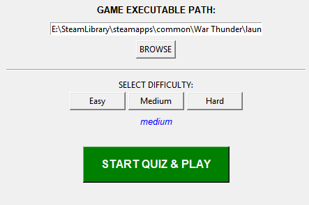

# Quiz Game Launcher

A desktop quiz-based game launcher built with Python and Tkinter that requires the user to complete a trivia challenge before launching a game.

The application fetches multiple-choice questions from the Open Trivia DB API. The user selects a difficulty level, answers a set of trivia questions through a graphical interface, and the game launches only if all answers are correct. If the user fails the challenge, the system shuts down after a configurable delay.

---

## Features

* Graphical interface built with Tkinter

* File browser to select the game executable

* Selectable difficulty levels:

  * **Easy:** 1 question
  * **Medium:** 2 questions
  * **Hard:** 3 questions

* Fetches random trivia questions from the Open Trivia DB API

* Displays shuffled multiple-choice answers

* Interactive quiz dialogs with real-time feedback

* Tracks score during the challenge

* Launches the game only if all answers are correct

* Optional system shutdown on failure

* Safe mode for development (disable shutdown)

* Validation of executable path

* Error handling for API failures and invalid inputs

* Centralized configuration system

---

## Technologies Used

* Python
* Tkinter (GUI)
* Requests
* Open Trivia DB API

---

## Configuration

Before running the application, configure the following variables in `main.py`:

```python
GAME_PATH = r'path_to_your_game_launcher'

SHUTDOWN_DELAY = 10
ENABLE_SHUTDOWN = True

DIFFICULTY_SETTINGS = {
    'easy': 1,
    'medium': 2,
    'hard': 3
}
```

* `GAME_PATH`: path to the game executable
* `SHUTDOWN_DELAY`: delay before shutdown in seconds
* `ENABLE_SHUTDOWN`: enables/disables shutdown behavior (recommended OFF during development)
* `DIFFICULTY_SETTINGS`: number of questions per difficulty

---

## Usage

1. Run the application:

```bash
python main.py
```

2. Select the game executable using the **Browse** button
3. Choose a difficulty level
4. Click **START QUIZ & PLAY**
5. Answer all questions correctly to launch the game

---

## Rules

* **Easy:** answer 1 question correctly
* **Medium:** answer 2 questions correctly
* **Hard:** answer 3 questions correctly
* If all answers are correct, the selected game launches
* If any answer is incorrect, the system may shut down (depending on configuration)

---

## Safety Notice

> By default, the application is configured to shut down the system if the quiz is failed.
>
> You can disable this behavior during development:
>
> ```python
> ENABLE_SHUTDOWN = False
> ```

---

## Preview



---

## Project Structure (current)

```
main.py        # Main application (GUI + logic)
assets/        # Screenshots and media
```

---

## Future Improvements

* Replace numeric input with clickable answer buttons (better UX)
* Persistent statistics (JSON or SQLite)
* Multiple game support (true launcher system)
* Improved UI layout (grid system / better styling)
* Modular architecture (separate UI, logic, and services)
