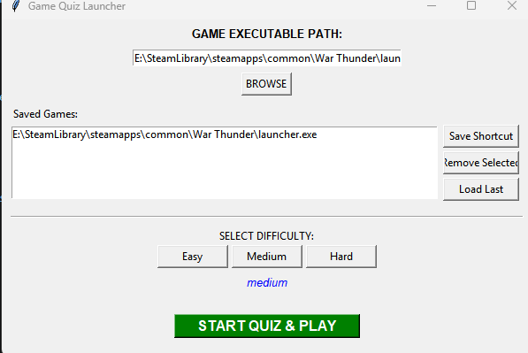

# Quiz Game Launcher

A desktop quiz-based game launcher built with Python and Tkinter. The user must complete a trivia challenge before launching the selected game.

The app fetches multiple-choice questions from the Open Trivia DB API. If all answers are correct, the game launches. If the user fails, the system can shut down after a configurable delay.

## Features

- Tkinter-based graphical interface
- File browser to select the game executable
- Saved games list with persistent shortcuts
- Load the last used game quickly
- Remove invalid or outdated paths automatically
- Difficulty levels: Easy, Medium, Hard
- Random trivia questions with shuffled answers
- Score tracking during the challenge
- Optional system shutdown on failure
- JSON-based persistence for saved game paths
- Retry logic for API requests

## Technologies Used

- Python
- Tkinter
- Requests
- Open Trivia DB API

## Installation

1. Create or activate your Python environment.
2. Install the dependencies:

    ```bash
    pip install -r requirements.txt
    ```

3. Run the launcher:

    ```bash
    python main.py
    ```

## Configuration

Before running the application, review the following values in `main.py`:

```python
GAME_PATH = r'path_to_your_game_launcher'
SHUTDOWN_DELAY = 10
ENABLE_SHUTDOWN = True

DIFFICULTY_SETTINGS = {
    'easy': 1,
    'medium': 2,
    'hard': 3,
}
```

## Data Persistence

Saved game paths are stored in:

```text
data/.quiz_launcher.json
```

The file stores up to 10 recent games, removes invalid paths automatically, and keeps the most recently used entries at the top.

## Usage

1. Select the game executable using the Browse button.
2. Optionally save it as a shortcut.
3. Choose a difficulty level.
4. Click Start Quiz & Play.
5. Answer all questions correctly to launch the game.

## Rules

- Easy: answer 1 question correctly
- Medium: answer 2 questions correctly
- Hard: answer 3 questions correctly
- If all answers are correct, the selected game launches
- If any answer is incorrect, the system may shut down depending on configuration

## Safety Notice

By default, the application can shut down the system if the quiz is failed.

To disable this behavior during development, set:

```python
ENABLE_SHUTDOWN = False
```

## Preview

 

## Project Structure

```text
main.py        # Main application (GUI + logic)
requirements.txt # Python dependencies
data/          # Persistent storage (JSON settings)
assets/        # Screenshots and media
README.md      # Project documentation
```

## Future Improvements

- Replace numeric input with clickable answer buttons
- Add persistent player statistics (JSON or SQLite)
- Support multiple games in the launcher
- Improve the UI layout and styling
- Split the app into separate modules for UI, logic, and storage
- Use async API calls to avoid UI freezing